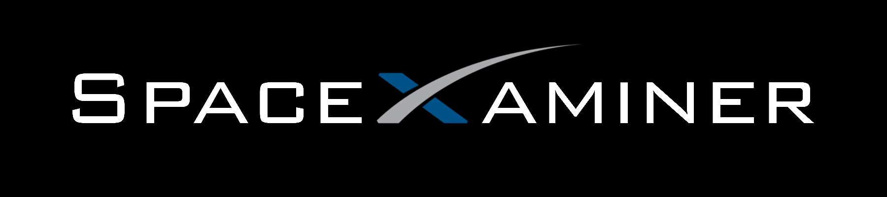

  

# [SpaceXaminer](https://www.github.com/derekkramer/spacexaminer "SpaceXaminer")

**SpaceXaminer** is a simple and easy-to-use 3D application that allows you to view all completed [SpaceX](https://spacex.com) rocket launches. The application is built in [React](https://facebook.github.io/react/) on a Node.js and Express back end. The 3D viewer is built in the [THREE.js](https://threejs.org) library, which is built on the WebGL API.

---

## Table of contents

- [Installation for Development](#Installation)
- [Community Resources](#Resources)
- [License](#License)

## Installation for Development

Navigate into the folder you want to clone the repository into and enter the following command into the terminal:

```
$ git clone https://www.github.com/spacexaminer
```

Navigate into the repository directory and enter the following command into the terminal:

```
$ npm install
```

Finally enter the following to the terminal to run the build:

```
$ npm start
```

## Community Resources

##### [](https://nodejs.org)
##### [](https://expressjs.com)
##### [](https://facebook.github.io/react/)
##### [](https://threejs.org)
##### [](https://www.khronos.org/webgl/)

## License

The MIT License (MIT)

Copyright &copy; 2017 Derek Kramer

Permission is hereby granted, free of charge, to any person obtaining a copy of this software and associated documentation files (the "Software"), to deal in the Software without restriction, including without limitation the rights to use, copy, modify, merge, publish, distribute, sublicense, and/or sell copies of the Software, and to permit persons to whom the Software is furnished to do so, subject to the following conditions:

The above copyright notice and this permission notice shall be included in all copies or substantial portions of the Software.

THE SOFTWARE IS PROVIDED "AS IS", WITHOUT WARRANTY OF ANY KIND, EXPRESS OR IMPLIED, INCLUDING BUT NOT LIMITED TO THE WARRANTIES OF MERCHANTABILITY, FITNESS FOR A PARTICULAR PURPOSE AND NONINFRINGEMENT. IN NO EVENT SHALL THE AUTHORS OR COPYRIGHT HOLDERS BE LIABLE FOR ANY CLAIM, DAMAGES OR OTHER LIABILITY, WHETHER IN AN ACTION OF CONTRACT, TORT OR OTHERWISE, ARISING FROM, OUT OF OR IN CONNECTION WITH THE SOFTWARE OR THE USE OR OTHER DEALINGS IN THE SOFTWARE.
